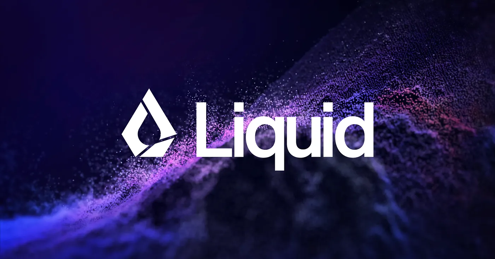
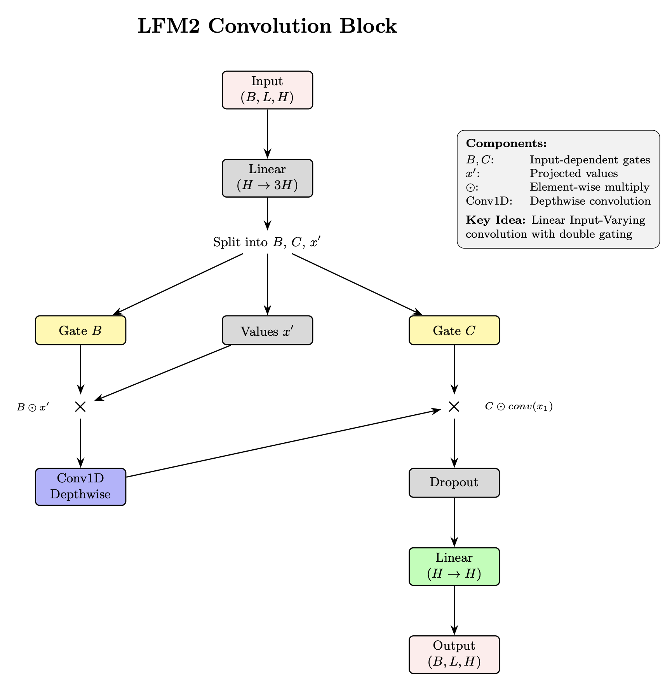
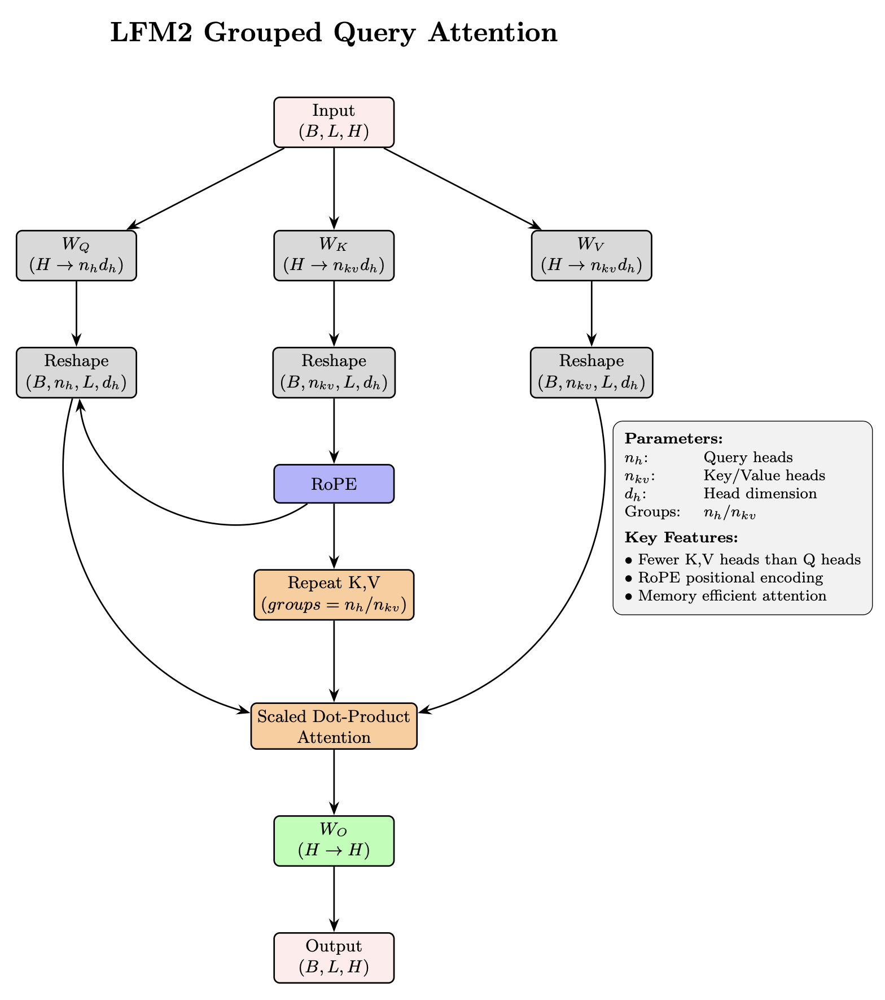
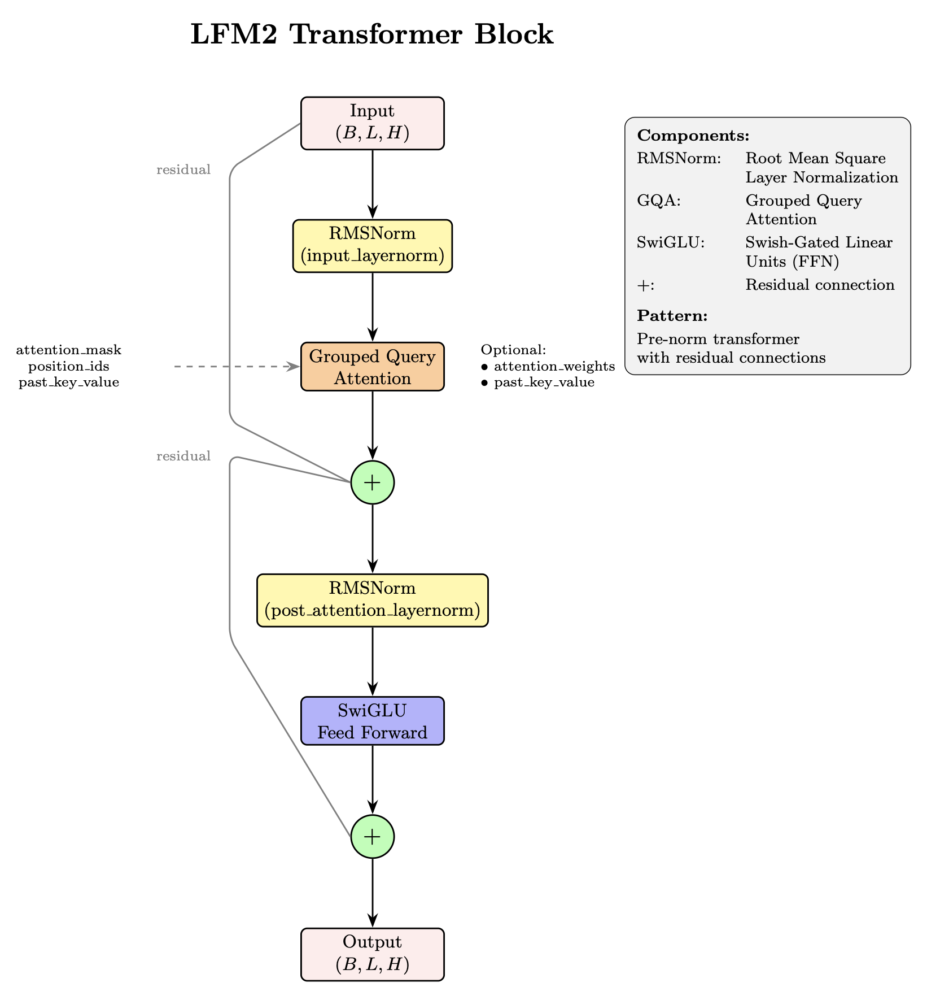
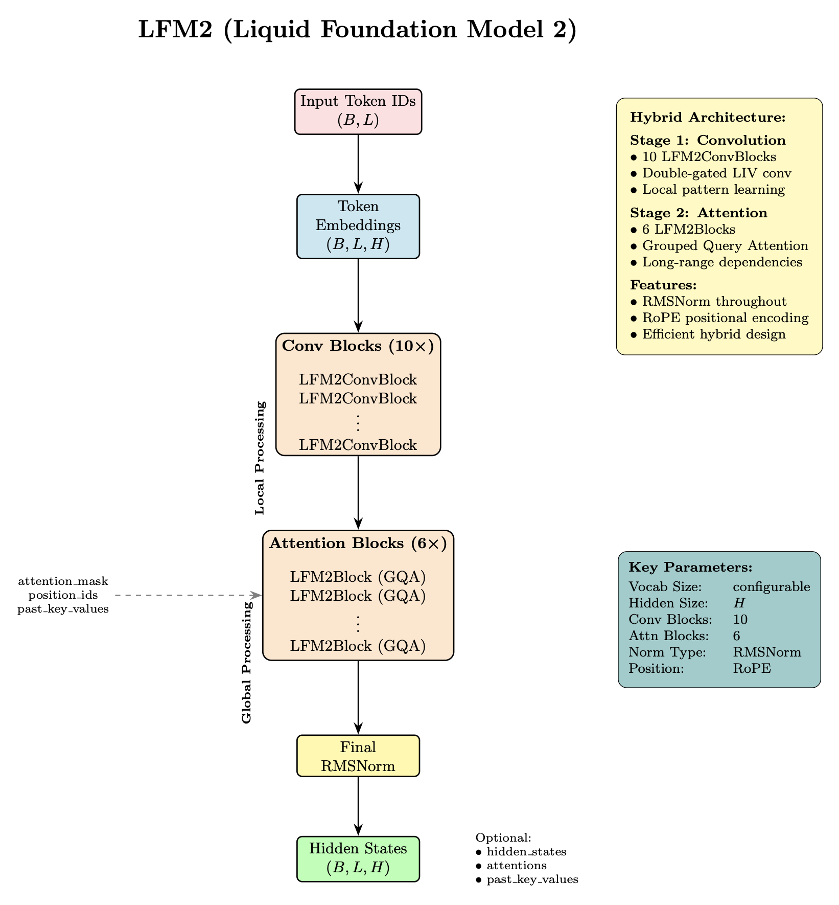

# Liquid-LLM
Liquid LLM from scratch

# LFM2 Architecture Diagrams

This directory contains architectural diagrams for the LFM2 (Liquid Foundation Model 2) implementation. Each diagram illustrates key components and their computational flow.

## Diagrams Overview

### 1. LFM2 Convolution Block

**Figure 1: LFM2 Convolution Block implementing Linear Input-Varying (LIV) convolution with double gating mechanism.** The input is projected to three components (gates B, C, and values x'), followed by input-dependent gating before and after depthwise convolution, enabling adaptive local pattern processing.

**Key Features:**
- Double gating mechanism with input-dependent gates B and C
- Depthwise convolution for computational efficiency
- Linear Input-Varying (LIV) convolution design
- Element-wise multiplication for adaptive filtering

---

### 2. Grouped Query Attention

**Figure 2: Grouped Query Attention (GQA) architecture showing memory-efficient attention computation.** Query projections use all heads (n_h) while key-value projections use fewer heads (n_kv), with K,V tensors repeated to match query heads. RoPE is applied to queries and keys for relative positional encoding.

**Key Features:**
- Memory-efficient attention with fewer K,V heads than Q heads
- Key-value head sharing across query groups (e.g., 16 Q heads, 4 KV heads)
- Rotary Positional Embedding (RoPE) for relative position encoding
- Reduced KV cache size for efficient generation

---

### 3. LFM2 Transformer Block

**Figure 3: LFM2 Transformer Block implementing pre-normalization pattern with residual connections.** The block combines RMSNorm, Grouped Query Attention, and SwiGLU feed-forward network, following the modern transformer architecture: x₁ = x + Attention(RMSNorm(x)), x₂ = x₁ + SwiGLU(RMSNorm(x₁)).

**Key Features:**
- Pre-normalization pattern for training stability
- RMSNorm instead of LayerNorm for efficiency
- Grouped Query Attention for memory efficiency
- SwiGLU activation in feed-forward network
- Dual residual connections

---

### 4. Complete LFM2 Model

**Figure 4: Complete LFM2 (Liquid Foundation Model 2) hybrid architecture.** The model processes tokens through two stages: 10 convolution blocks for local pattern learning followed by 6 attention blocks for global dependency modeling, concluding with final RMSNorm before output projection.

**Key Features:**
- Hybrid architecture: Convolution → Attention
- Stage 1: 10 LFM2ConvBlocks for local processing
- Stage 2: 6 LFM2Blocks for global processing
- Token embeddings and final normalization
- Optional caching for generation tasks

---

## Architecture Summary

The LFM2 model represents a hybrid approach combining:

1. **Local Processing**: Convolution blocks with double-gated LIV convolution
2. **Global Processing**: Attention blocks with Grouped Query Attention
3. **Modern Components**: RMSNorm, RoPE, SwiGLU
4. **Efficiency Features**: Memory-efficient attention, depthwise convolution

### Model Configurations

| Model Size | Hidden Size | Conv Blocks | Attention Blocks | Attention Heads | KV Heads |
|------------|-------------|-------------|------------------|-----------------|----------|
| 350M       | 768         | 10          | 6                | 12              | 3        |
| 700M       | 1024        | 10          | 6                | 16              | 4        |
| 1.2B       | 1536        | 10          | 6                | 24              | 6        |

---

